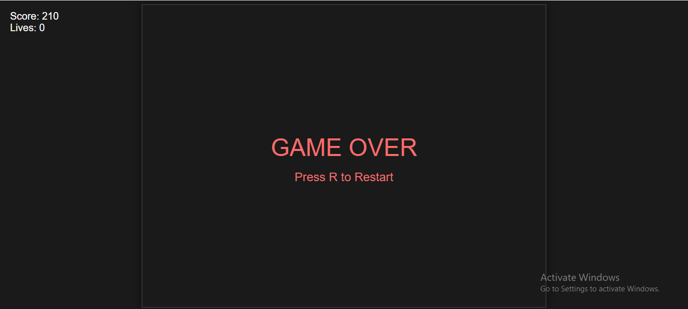
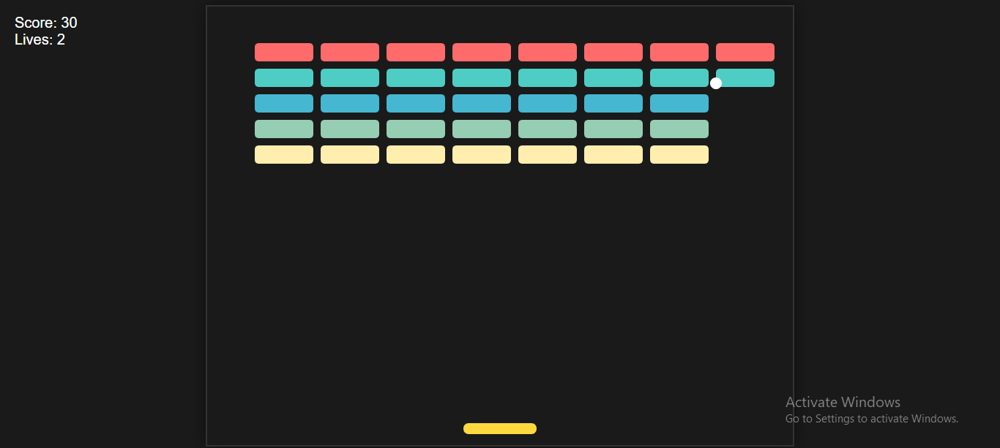

# Arkanoid Game (JS-Versions)

A classic Arkanoid/Breakout style game implemented in JS.

## Requirements
- Arkanoid game
- Paddle 

## Installation
1. Install the required dependencies:
```bash
git clone 
```

## How to Play
1. Run the game:
```bash
Local Server locally
```

2. Controls:
- Left Arrow: Move paddle left
- Right Arrow: Move paddle right
- Close window to quit

## Game Features
- Classic brick-breaking gameplay
- Score tracking
- Lives system
- Colorful blocks
- Win/lose conditions

## Screenshots



